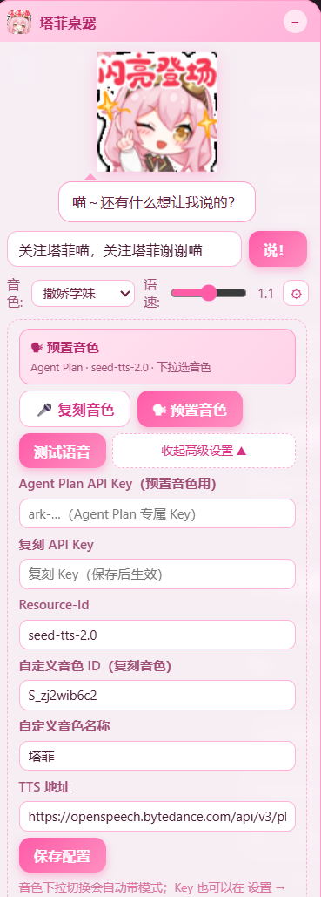
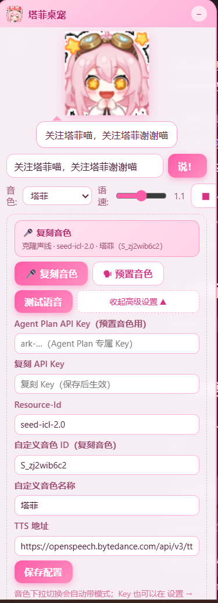

# 塔菲语音播报桌宠（Taffy Voice Desk Pet）

一个运行在 **DeepSeek Harness（DSH）Web 界面**上的可拖拽语音桌宠：输入任意文字，
用**火山引擎（Volcengine）豆包语音**合成并播报，支持 **14 种预置音色** 与
**自定义声音复刻音色（克隆声线）** 两种模式。

**跨平台**：Windows / macOS / Linux 均可安装运行（TTS 用 Node 内置 fetch，
规避 Windows 沙箱 schannel 问题）。


## 演示

<p align="center">
  
  
  
</p>

<video controls width="480" poster="docs/demo/demo-1.png">
  <source src="https://github.com/zq123123667/dsh-taffy-pet/releases/download/demo-media/demo.mp4" type="video/mp4">
  你的浏览器不支持视频播放，请下载
  <a href="https://github.com/zq123123667/dsh-taffy-pet/releases/download/demo-media/demo.mp4">演示视频（GitHub Releases）</a> 查看。
</video>

## 仓库结构（单一来源，无历史残留）

```
dsh-taffy-pet/
├── dsh-client-ui-taffy-pet/   # ★ 唯一插件包（完整源码 + 构建脚本 + 素材 + 文档）
│   ├── src/host.js            #   Host 源码（动态模式直接作为 code.host）
│   ├── src/client.js          #   Client 源码（动态模式直接作为 code.client）
│   ├── scripts/build.mjs      #   构建：src/ → lib/（lib/ 为构建产物，不入库）
│   └── README.md              #   完整安装 / 配置 / FAQ
└── INSTALL.md                 # 全新环境完整安装流程
```

> 旧版的 `src/`（动态版）与 `static-version/`（静态版）已并入
> `dsh-client-ui-taffy-pet/`（一份源码，两种安装模式共用），不再单独维护。

## 快速开始

全新环境请直接照 [INSTALL.md](INSTALL.md) 走；或看插件包内的
[dsh-client-ui-taffy-pet/README.md](dsh-client-ui-taffy-pet/README.md)。

```bash
# 1) 构建产物（lib/ 不入库，克隆后需先构建）
cd dsh-client-ui-taffy-pet && node scripts/build.mjs

# 2) 按 INSTALL.md 挂载到 ~/.dsh/profiles/web 后启动
dsh web（默认端口 3080）

# 3) 浏览器打开 http://127.0.0.1:3080 → 右下角「🐱 启动塔菲桌宠」
#    API Key 在 设置 → 插件 → 塔菲桌宠 里填写
```

## 两种安装模式

| 模式 | 说明 |
| --- | --- |
| **动态模式** | 把 `dsh-client-ui-taffy-pet/src/host.js`、`src/client.js` 作为 `code.host` / `code.client` 注册，进程内临时 |
| **标准/静态模式** | link 进 `~/.dsh/profiles/web` + `cordis.patch.yml` insert，重启自动加载，跨重启永久 |

> 二选一，不要同时启用。

## License

MIT（素材版权归原作者所有，仅随插件分发用于个人用途）。
